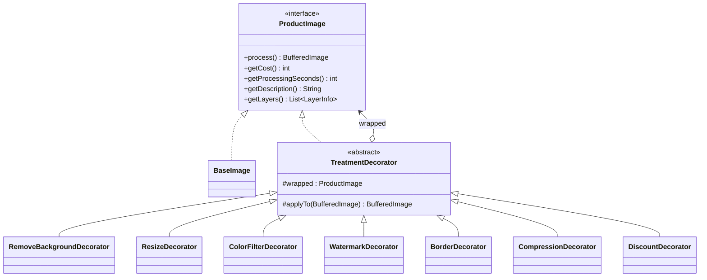

# PixelForge: Patrón Decorator (Patrones de Software, UCC)

## 1. El caso de estudio en 1 minuto

**PixelForge** es un servicio que edita automáticamente fotos de producto para tiendas en línea.
El comerciante sube una foto (unos tenis, una taza…), escoge qué tratamientos quiere **y en qué orden**,
y recibe la imagen lista junto con el precio y el tiempo estimado.

| Tratamiento (id en el código) | Qué hace | Costo (COP) | Tiempo |
|---|---|---|---|
| `BASE` (siempre va) | Valida y normaliza la foto | 500 | 1 s |
| `REMOVE_BACKGROUND` | Vuelve transparente el fondo | 1.500 | 4 s |
| `RESIZE` | Ajusta a 1080×1080 | 300 | 1 s |
| `COLOR_FILTER:<tipo>` | `GRAYSCALE`, `BRIGHTEN` o `HIGH_CONTRAST` | 400 | 1 s |
| `WATERMARK:<texto>` | Escribe el nombre de la tienda | 600 | 2 s |
| `BORDER:<color hex>` | Marco de color, ej. `FF0000` | 200 | 1 s |
| `COMPRESSION` | Re-codifica como JPEG liviano | 250 | 1 s |

**Reglas de negocio**
- Un tratamiento se puede repetir (ej. dos filtros).
- `COMPRESSION` debe ir de **último** (el JPEG pierde la transparencia). Si no, el backend responde error 400.
- Con **4 o más** tratamientos se aplica un **10 % de descuento** automáticamente.

## 2. ¿Por qué Decorator?

Si lo hiciéramos con herencia tendríamos clases como `ImageWithoutBackgroundAndWatermark`,
`ResizedImageWithFilterAndBorder`… Con 6 tratamientos son 2⁶ = 64 combinaciones, y además
**el orden importa**, cosa que la herencia no puede representar.

Con Decorator cada tratamiento **envuelve** al anterior y le agrega su parte:

```java
ProductImage photo =
    new CompressionDecorator(                 // 4. comprime
        new WatermarkDecorator(               // 3. pone la marca de agua
            new ResizeDecorator(              // 2. redimensiona
                new RemoveBackgroundDecorator(// 1. quita el fondo
                    new BaseImage(original))),
            "MyStore"));

photo.process();   // aplica las capas de adentro hacia afuera
photo.getCost();   // 500 + 1500 + 300 + 600 + 250 = 3150
```

El que usa `photo` no sabe cuántas capas tiene; solo ve un `ProductImage`.

## 3. Roles del patrón → clases

| Rol del patrón | Clase | Archivo |
|---|---|---|
| **Component** (interfaz común) | `ProductImage` | `core/ProductImage.java` |
| **Concrete Component** (el objeto original) | `BaseImage` | `core/BaseImage.java` |
| **Decorator** (abstracto, tiene un `ProductImage` adentro) | `TreatmentDecorator` | `core/TreatmentDecorator.java` |
| **Concrete Decorators** | `RemoveBackgroundDecorator`, `ResizeDecorator`, `ColorFilterDecorator`, `WatermarkDecorator`, `BorderDecorator`, `CompressionDecorator`, `DiscountDecorator` | `treatments/` |

Comparado con el ejemplo de clase (reproductor de música): `MusicPlayer` = `ProductImage`,
`SimpleMusicPlayer` = `BaseImage`, `MusicPlayerDecorator` = `TreatmentDecorator`,
`EqualizerDecorator` = cualquiera de los tratamientos.

**Dato clave:** `TreatmentDecorator.process()` hace exactamente lo mismo que `play()` en el ejemplo de clase:
primero llama al objeto envuelto (`wrapped.process()`) y luego agrega lo suyo (`applyTo(...)`).

`DiscountDecorator` es un caso especial: **no toca la imagen**, solo cambia el precio. Muestra que un
decorador puede extender solo una parte del comportamiento.



## 4. Estructura del proyecto

```
src/com/pixelforge/
├── Main.java                  Demo por consola (arma los decoradores "a mano")
├── core/                      El patrón: interfaz, componente base, decorador abstracto
│   ├── ProductImage.java
│   ├── BaseImage.java
│   ├── TreatmentDecorator.java
│   ├── TreatmentType.java     Catálogo con precios y tiempos (único lugar donde están)
│   └── LayerInfo.java         Una fila del desglose de costos
├── treatments/                Decoradores concretos (uno por tratamiento)
├── pipeline/
│   ├── TreatmentRequest.java  Convierte "WATERMARK:MyStore" en un objeto
│   └── PipelineBuilder.java   Arma la cadena en el orden pedido + reglas de negocio
├── orders/                    Historial de pedidos (en memoria)
├── service/
│   └── ImageProcessingService.java   Caso de uso: procesar una foto
└── api/
    ├── ApiServer.java         API REST para el frontend
    └── Json.java              Convierte objetos a JSON
test/com/pixelforge/
└── DecoratorTests.java        6 pruebas (sin JUnit)
```

Solo usa Java estándar (JDK 11 o superior). **No necesita Maven ni librerías.**

## 5. Cómo ejecutarlo

**Desde IntelliJ / VS Code:** abrir la carpeta, marcar `src` y `test` como carpetas de código fuente, y ejecutar:
- `Main` → demo por consola; guarda imágenes en la carpeta `output/`
- `DecoratorTests` → corre las pruebas
- `ApiServer` → levanta el API en `http://localhost:8080`

**Desde la terminal** (dentro de la carpeta del proyecto):
```bash
javac -d out $(find src test -name "*.java")
java -cp out com.pixelforge.Main            # demo
java -cp out com.pixelforge.DecoratorTests  # pruebas
java -cp out com.pixelforge.api.ApiServer   # API para el frontend
```
En Windows (PowerShell), compilar con:
`javac -d out (Get-ChildItem -Recurse -Filter *.java src,test).FullName`

## 6. API para el frontend

CORS está habilitado, así que el frontend puede abrirse desde cualquier puerto o como archivo.

### `GET /api/treatments`
Catálogo para construir el menú dinámicamente:
```json
[{"id":"WATERMARK","name":"Watermark","cost":600,"seconds":2,"parameterHint":"text to print"}, ...]
```

### `POST /api/process?treatments=<lista>`
- **Body:** los bytes de la imagen tal cual (JPG o PNG, máx. 5 MB). No es multipart.
- **`treatments`:** lista separada por comas **en el orden** que eligió el usuario. Parámetros con `:`.
  Ej.: `REMOVE_BACKGROUND,RESIZE,WATERMARK:Mi Tienda,BORDER:FF0000,COMPRESSION`

Respuesta 200:
```json
{
  "order": {
    "id": 1,
    "description": "Base image + Remove background + ... + Discount 10%",
    "totalCost": 2835,
    "totalSeconds": 9,
    "layers": [{"name":"Base image","cost":500,"seconds":1}, ..., {"name":"Discount 10%","cost":-315,"seconds":0}]
  },
  "imageFormat": "jpg",
  "imageBase64": "/9j/4AAQ..."
}
```
`layers` viene **de adentro hacia afuera**: sirve para dibujar las capas anidadas del decorador y la tabla de costos.

Error 400 (regla de negocio o dato inválido):
```json
{"error": "COMPRESSION must be the last treatment"}
```

### `GET /api/orders`
Lista de pedidos procesados (mismo formato que `order`).

### Ejemplo con `fetch`
```js
const file = document.querySelector('#photo').files[0];
const treatments = ['REMOVE_BACKGROUND', 'RESIZE', 'WATERMARK:Mi Tienda', 'COMPRESSION'];

const res = await fetch(
  'http://localhost:8080/api/process?treatments=' + encodeURIComponent(treatments.join(',')),
  { method: 'POST', body: file }
);
const data = await res.json();
if (!res.ok) { alert(data.error); return; }

document.querySelector('#result').src = `data:image/${data.imageFormat};base64,${data.imageBase64}`;
console.log(data.order.layers); // desglose por capa
```

## 7. ¿Cómo agrego un tratamiento nuevo?

1. Agregar una constante en `TreatmentType` (nombre, costo, tiempo).
2. Crear `XxxDecorator extends TreatmentDecorator` e implementar `applyTo(...)`.
3. Agregar un `case` en `PipelineBuilder.wrap(...)`.

No hay que modificar `BaseImage` ni los demás decoradores (principio **abierto/cerrado**).
La prueba `newDecoratorWorksWithoutChangingExistingClasses` lo demuestra.
